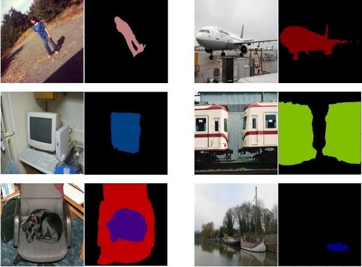

# pytorch-deeplab-xception

### TODO
- [x] Basic deeplab v3+ model, using modified xception as backbone
- [x] Training deeplab v3+ on Pascal VOC 2012, SBD, Cityscapes datasets
- [x] Results evaluation on Pascal VOC 2012 test set
- [x] Deeplab v3+ model using resnet as backbone


### Introduction
This is a PyTorch(0.4.0) implementation of [DeepLab-V3-Plus](https://arxiv.org/pdf/1802.02611). It
can use Modified Aligned Xception and ResNet as backbone. Currently, we train DeepLab V3 Plus
using Pascal VOC 2012, SBD and Cityscapes datasets.



We trained deeplab v3+ (xception) on Pascal VOC 2012 and SBD datasets. After 50 training epoch, our
deeplab v3+ model can reach 74.4% mIoU on Pascal VOC 2012 test set. More results will be available
soon!

### Installation
The code was tested with Anaconda and Python 3.5. After installing the Anaconda environment:

0. Clone the repo:
    ```Shell
    git clone https://github.com/jfzhang95/pytorch-deeplab-xception.git
    cd pytorch-deeplab-xception
    ```

1. Install dependencies:

    For PyTorch dependency, see [pytorch.org](https://pytorch.org/) for more details.

    For custom dependencies:
    ```Shell
    pip install matplotlib pillow tensorboardX
    ```

2. Configure your dataset path in [mypath.py](https://github.com/jfzhang95/pytorch-deeplab-xception/blob/master/mypath.py).

3. You can train deeplab v3+ using xception or resnet as backbone.

    To train DeepLabV3+ on Pascal VOC 2012, please do:
    ```Shell
    python train.py
    ```

    To train it on Cityscapes, please do:
    ```Shell
    python train_cityscapes.py
    ```


